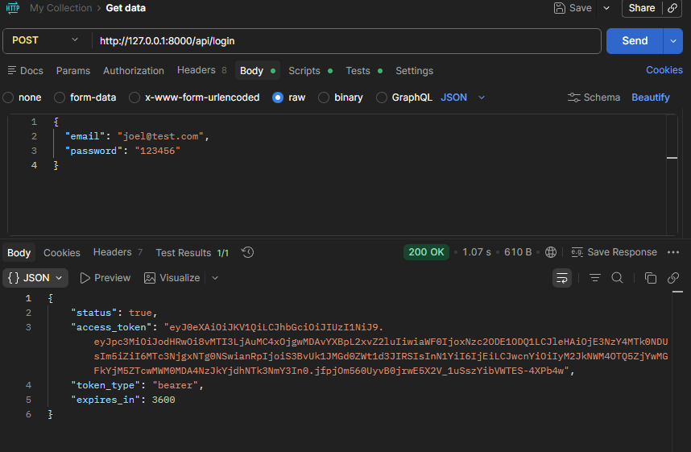
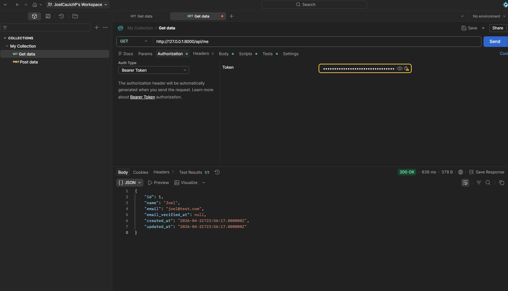
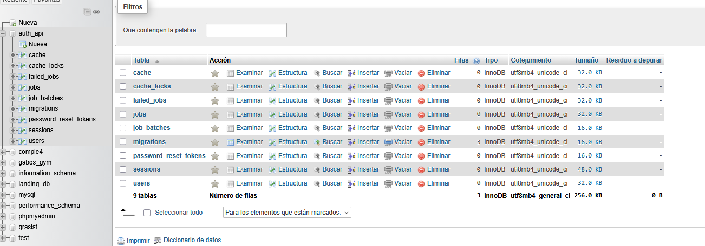
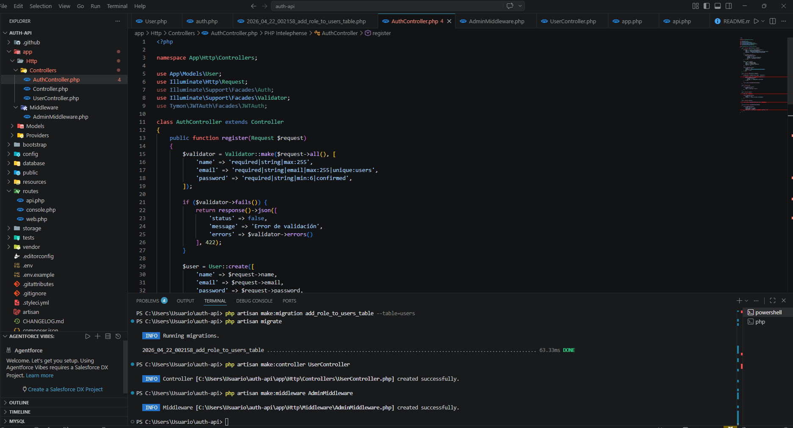

# 🔐 Auth API con Laravel + JWT

API REST para autenticación segura de usuarios desarrollada con Laravel, MySQL y JWT.
Incluye registro, inicio de sesión, manejo de tokens, rutas protegidas y control de acceso por roles.

---

## 🚀 Tecnologías utilizadas

* PHP 8.x
* Laravel 12
* MySQL
* JWT (tymon/jwt-auth)
* Postman (pruebas de endpoints)

---

## 📦 Instalación

1. Clonar el repositorio:

```bash
git clone https://github.com/TU_USUARIO/auth-api-laravel-jwt.git
cd auth-api-laravel-jwt
```

2. Instalar dependencias:

```bash
composer install
```

3. Configurar archivo `.env`:

```env
DB_DATABASE=auth_api
DB_USERNAME=root
DB_PASSWORD=
```

4. Generar clave de aplicación:

```bash
php artisan key:generate
```

5. Generar clave JWT:

```bash
php artisan jwt:secret
```

6. Ejecutar migraciones:

```bash
php artisan migrate
```

7. Levantar servidor:

```bash
php artisan serve
```

---

## 🔑 Autenticación

La API utiliza JWT para autenticar usuarios.
Después de hacer login, debes enviar el token en cada request:

```
Authorization: Bearer TU_TOKEN
```

---

## 📌 Endpoints principales

### 🔹 Registro

**POST** `/api/register`

```json
{
  "name": "Joel",
  "email": "joel@test.com",
  "password": "123456",
  "password_confirmation": "123456"
}
```

---

### 🔹 Login

**POST** `/api/login`

```json
{
  "email": "joel@test.com",
  "password": "123456"
}
```

---

### 🔹 Usuario autenticado

**GET** `/api/me`

---

### 🔹 Listar usuarios (solo admin)

**GET** `/api/users`

---

## 🔐 Roles

Cada usuario tiene un rol asignado:

* `user` (por defecto)
* `admin`

El endpoint `/api/users` está protegido y solo puede ser accedido por administradores.

---

## 📸 Capturas

### 🔹 Login (Generación de token JWT)



### 🔹 Usuario autenticado (/me)



### 🔹 Base de datos



### 🔹 Estructura del proyecto



---

## 📁 Estructura del proyecto

* `app/Http/Controllers` → lógica de la API
* `app/Models` → modelos de datos
* `routes/api.php` → endpoints
* `database/migrations` → estructura de base de datos

---

## 🎯 Funcionalidades implementadas

* Registro de usuarios
* Login con JWT
* Generación de tokens
* Middleware de autenticación
* Protección de rutas
* Control de acceso por roles (admin/user)
* Endpoint para consulta de usuarios

---

## 🧪 Pruebas

Las pruebas se realizaron con Postman, validando:

* Registro de usuario
* Login
* Acceso a rutas protegidas
* Validación de roles

---

## 👨‍💻 Autor

Desarrollado por Joel Cauich
